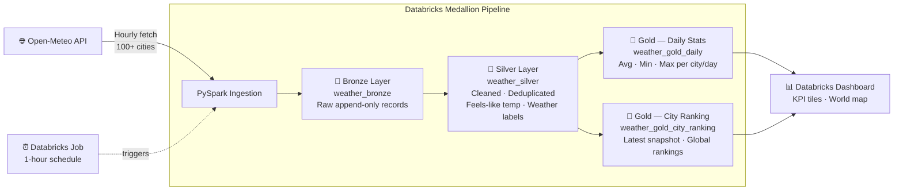
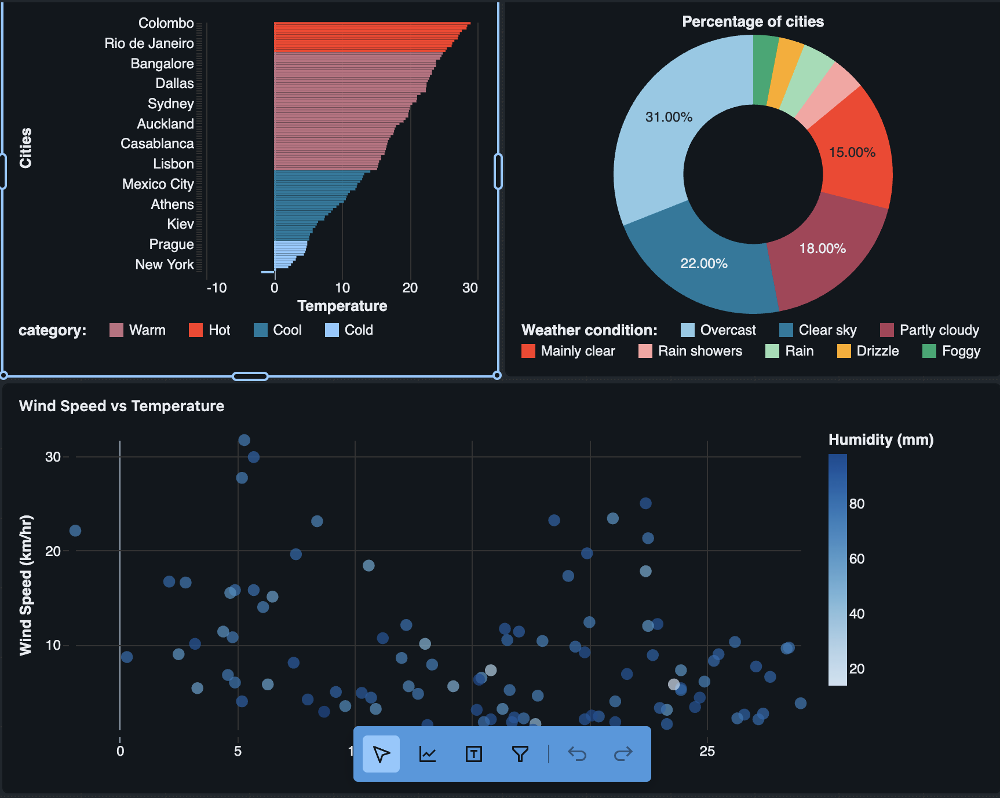

# Weather Watch

A global weather data pipeline built with PySpark that fetches hourly weather data for 100+ cities worldwide using the Open-Meteo API, designed to run as a scheduled job on Databricks.

## Architecture



## Overview

This pipeline collects real-time weather data every hour across major cities in North America, South America, Europe, Africa, the Middle East, Asia, and Oceania.

## Data Collected

| Field | Description |
|---|---|
| `temperature_c` | Temperature in Celsius |
| `humidity_pct` | Relative humidity (%) |
| `wind_speed_kmh` | Wind speed (km/h) |
| `precipitation_mm` | Precipitation (mm) |
| `weather_code` | WMO weather condition code |

## Tech Stack

- **PySpark** — distributed data processing
- **Open-Meteo API** — free, no-key-required weather API
- **Databricks** — scheduled job execution (hourly refresh)

## Setup

### Local
```bash
pip install -r requirements.txt
python weather_pipeline.py
```

### Databricks
1. Import this repo via **Databricks Repos** (Repos → Add Repo → paste GitHub URL)
2. Create a new **Job** pointing to `weather_pipeline.py`
3. Set the schedule to **every 1 hour**

## Dashboard

The pipeline feeds a live Databricks dashboard with global weather KPIs and an interactive world map.




> Dashboard exported as `dashboards/Weather_Dashboard.lvdash.json` — import it directly into Databricks.

## Cities Covered

100 cities across 7 regions:
- North America, South America, Europe, Africa, Middle East, Asia, Oceania
