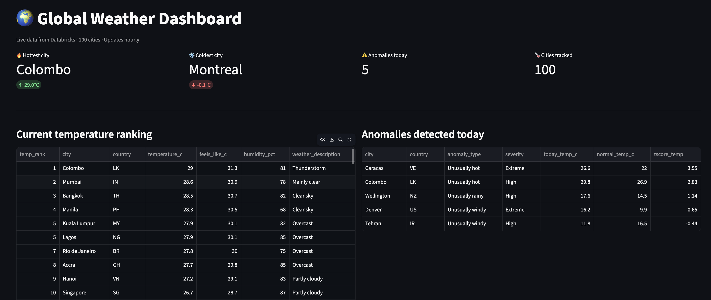
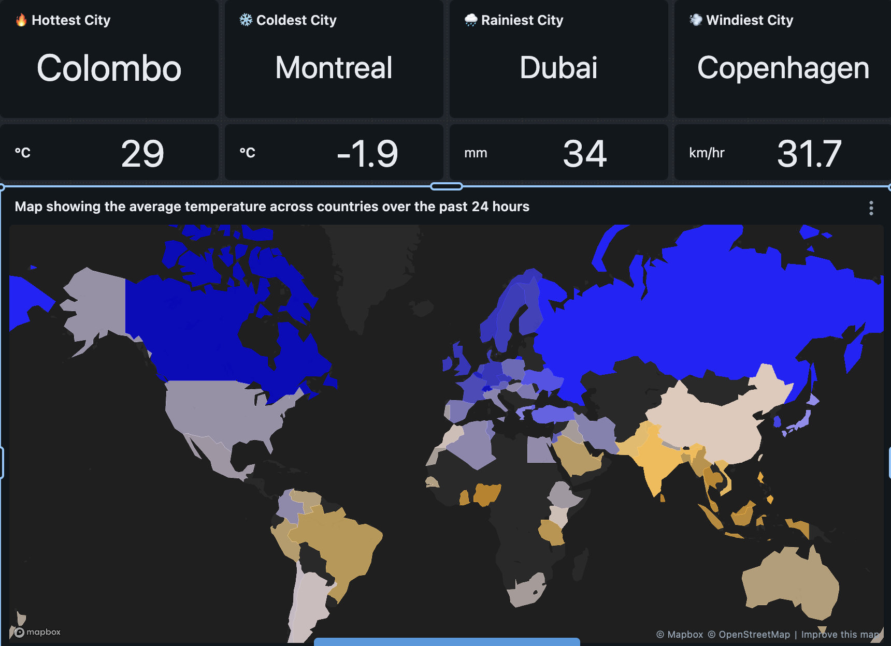
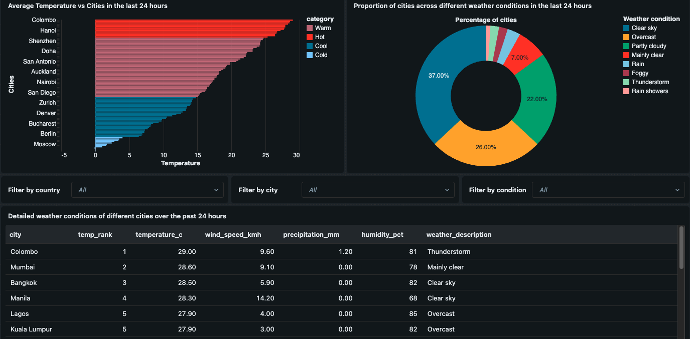
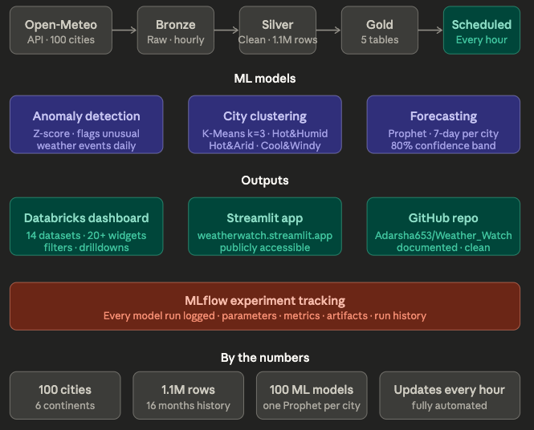

# 🌍 Weather Watch

> A global weather analytics pipeline built on Databricks — 100 cities, 6 continents, fully automated.

[](https://weatherwatch.streamlit.app)
[](https://github.com/Adarsha653/Weather_Watch)

---

## 📸 Screenshots

### Streamlit App — Live Dashboard


### Databricks Dashboard — Choropleth Map


### Databricks Dashboard — Charts & Drilldown


---

## 🏗️ Architecture



The pipeline follows a **Bronze → Silver → Gold** medallion architecture:

- **Bronze** — raw hourly API records appended on every run
- **Silver** — cleaned, deduplicated, enriched with feels-like temperature and weather descriptions (1.1M rows, 16 months)
- **Gold** — five purpose-built tables powering the dashboards and ML models
- **Scheduled** — Databricks Job runs every hour, fully automated with data quality checks

---

## 🤖 ML Models

### Anomaly Detection (Z-score)
Compares each city's current weather against its 16-month historical baseline. Flags cities where temperature, wind, or precipitation is more than 2.5 standard deviations from normal. Results written to `weather_gold_anomalies`.

### City Clustering (K-Means)
Groups all 100 cities into climate types purely from historical weather patterns — no geography used. Optimal k=3 selected via silhouette score. Three clusters identified:
- **Hot & Humid** — 29 cities (avg 23.5°C, 74.5% humidity)
- **Dry** — 19 cities (avg 20.7°C, 50.6% humidity)
- **Humid & Mild** — 52 cities (avg 12.9°C, 73.2% humidity)

### Temperature Forecasting (Prophet)
One Facebook Prophet model trained per city using daily historical averages. Produces 7-day forecasts with 80% confidence intervals. 100 models trained in under 5 minutes. All runs tracked in MLflow.

---

## 📊 Outputs

| Output | Description |
|--------|-------------|
| **Databricks Dashboard** | 14 datasets, 20+ widgets — choropleth map, KPI tiles, bar/pie charts, anomaly table, cluster table, forecast chart, drilldowns with country/city/condition filters |
| **Streamlit App** | Live public app at [weatherwatch.streamlit.app](https://weatherwatch.streamlit.app) — queries Gold tables directly from Databricks |
| **MLflow Experiments** | Every clustering and forecasting run logged with parameters, metrics, and artifacts |

---

## 🛠️ Tech Stack

| Layer | Tools |
|-------|-------|
| Data platform | Databricks, Apache Spark, Delta Lake |
| Pipeline | PySpark, Open-Meteo API, Databricks Jobs |
| ML | Prophet, scikit-learn (K-Means), Z-score (PySpark) |
| Experiment tracking | MLflow |
| Serving | Streamlit, Plotly, databricks-sql-connector |
| Version control | Git, GitHub |

---

## 📦 By the Numbers

| Metric | Value |
|--------|-------|
| Cities tracked | 100 across 6 continents |
| Historical data | 16 months (Dec 2024 → present) |
| Silver rows | 1,168,176 |
| ML models | 100 Prophet models (one per city) |
| Pipeline cadence | Every hour, fully automated |
| Forecast horizon | 7 days per city |

---

## 🚀 Setup

### Prerequisites
- Databricks workspace (free edition works)
- Python 3.9+

### Local Streamlit app

```bash
# Clone the repo
git clone https://github.com/Adarsha653/Weather_Watch.git
cd Weather_Watch

# Create virtual environment
python3 -m venv venv
source venv/bin/activate

# Install dependencies
pip install -r requirements.txt

# Set up credentials
cp .env.example .env
# Edit .env with your Databricks connection details

# Run the app
streamlit run weather_app.py
```

### Databricks notebooks (run in this order)

| # | Notebook | Purpose | Run |
|---|----------|---------|-----|
| 1 | `notebooks/backfill_historical.py` | One-time 16-month data backfill | Once |
| 2 | `notebooks/Weather_pipeline.py` | Hourly fetch → Bronze → Silver → Gold | Scheduled hourly |
| 3 | `notebooks/weather_anomaly_detection.py` | Z-score anomaly detection | After pipeline |
| 4 | `notebooks/weather_city_clustering.py` | K-Means climate clustering | After pipeline |
| 5 | `notebooks/weather_forecasting.py` | Prophet 7-day forecasting | After pipeline |

---

## 🔐 Environment Variables

Copy `.env.example` to `.env` and fill in your Databricks details:

```
SERVER_HOSTNAME=your-workspace.azuredatabricks.net
HTTP_PATH=/sql/1.0/warehouses/your-warehouse-id
ACCESS_TOKEN=your-databricks-token
CATALOG=workspace
SCHEMA=default
```

> Never commit your `.env` file. It's already in `.gitignore`.

---

## 📁 Project Structure

```
Weather_Watch/
├── README.md
├── requirements.txt
├── .env.example
├── .gitignore
├── db_connection.py          # Databricks SQL connector
├── weather_app.py            # Streamlit app
├── screenshots/              # Dashboard and app screenshots
└── notebooks/
    ├── Weather_pipeline.py
    ├── backfill_historical.py
    ├── weather_anomaly_detection.py
    ├── weather_city_clustering.py
    └── weather_forecasting.py
```

---

*Built by Adarsha Aryal · [weatherwatch.streamlit.app](https://weatherwatch.streamlit.app)*